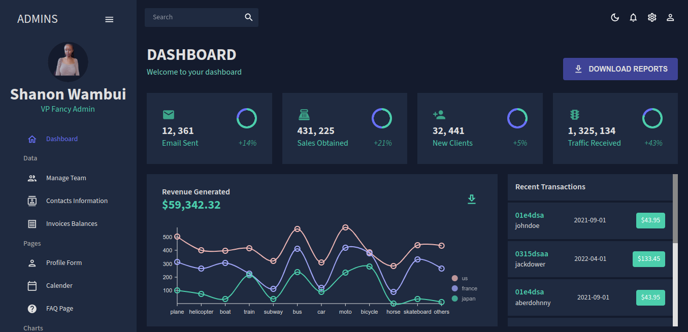

# ADMIN REACT DASHBOARD



### Install plugins
```
npm i @mui/material @emotion/react @emotion/styled @mui/x-data-grid @mui/icons-material react-router-dom@6 react-pro-sidebar formik yup @fullcalendar/core @fullcalendar/daygrid @fullcalendar/timegrid @fullcalendar/list @nivo/core @nivo/pie @nivo/line @nivo/bar @nivo/geo
```

create-react-app: https://create-react-app.dev/

Material UI: https://mui.com/material-ui/getting-started/installation/

Nivo charts: https://nivo.rocks/components

Full calendar: https://fullcalendar.io/docs

Formik: https://formik.org/docs/overview#installation

Yup validation: https://github.com/jquense/yup

React pro sidebar: https://github.com/azouaoui-med/react-pro-sidebar

Google fonts: https://fonts.google.com/